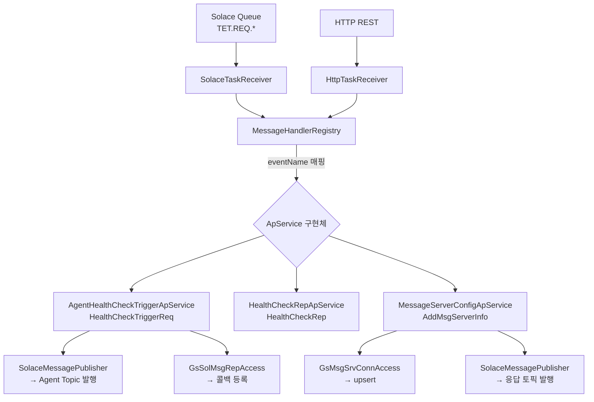
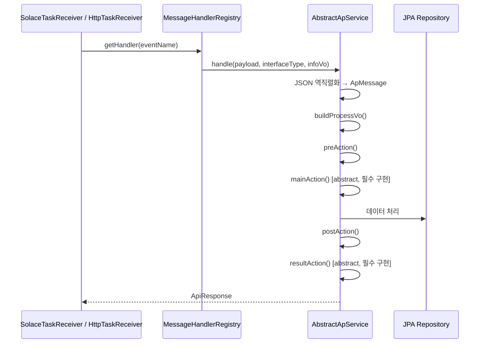
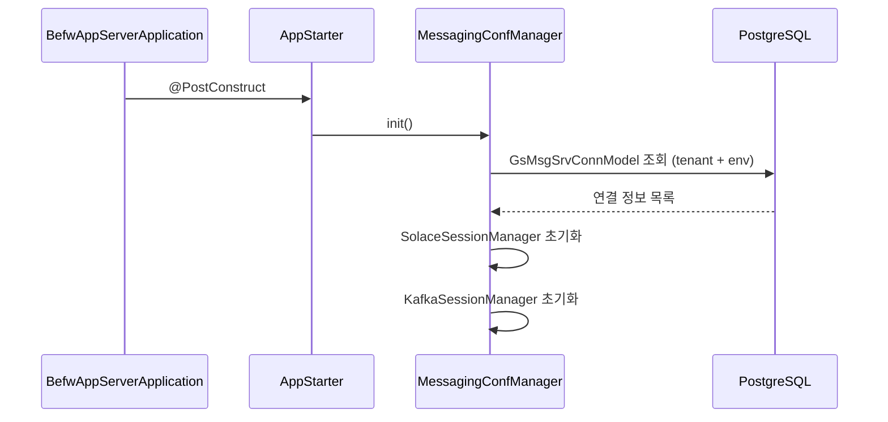

# befw-app-server — 애플리케이션 서버

## 프로젝트 개요

| 항목                | 내용                                                                 |
|-------------------|--------------------------------------------------------------------|
| **역할**            | BEFW 실행 가능한 Spring Boot 앱 서버                                       |
| **GroupId**       | `com.tsh.starter.befw`                                             |
| **ArtifactId**    | `befw-app-server`                                                  |
| **Version**       | `1.0.0-SNAPSHOT`                                                   |
| **Parent**        | `befw:1.0-SNAPSHOT`                                                |
| **핵심 의존성**        | `befw-lib-core:1.0.0-SNAPSHOT`                                     |
| **Base Package**  | `com.tsh.starter.befw.app.server`                                  |
| **Scan Packages** | `com.tsh.starter.befw.lib.core`, `com.tsh.starter.befw.app.server` |

---

## 폴더 및 파일 생성 규칙

- App 모듈은 단위 서비스에 대한 개발 수행
- 모든 파일이나 폴더는 단위 서비스로 식별이 가능해야함
- 주요 폴더
    - 데이터 관련 폴더 및 파일
        - 경로
            - com/tsh/starter/befw/app/server/data/orm
        - 기준
            1. 단위 서비스에서 생성되는 폴더는 서비스명으로 구분
                - 단위 서비스별 data 접근은 서비스명 기준으로 구분되야함
                - ex) custom jira 프로젝트는 cira로 관련한 파일은 cira 폴더 하위에 생성되야함
            2. 폴더는 테이블 이름의 prefix를 제외한 글자의 camel-case로 생성
                - ex) ST_ORG_WRKR_REL: stOrgWrkRel 로 표현
            3. 각 파일 성격에 따른 파일 명
                - JPA Service
                    - 기본 테이블 명 뒤에 "Access" 로 파일 명 생성
                        - ex) GS_SOL_MSG_REP 테이블의 JPA Service: GsSolMsgRepAccess
                - Entity
                    - 기본 테이블 명 뒤에 "Model" 로 파일 명 생성
                        - ex) GS_SOL_MSG_REP 테이블의 Entity: GsSolMsgRepModel
                - Jpa Repository
                    - 기본 테이블 명 뒤에 "Repo" 로 파일 명 생성
                        - ex) GS_SOL_MSG_REP Jpa Repository: GsSolMsgRepRepo
            4. 유형별 네이밍
                - 클래스: 첫 글자 대문자로 생성
                - 폴더: 첫 글자는 소문자로 생성

  ---

## 메시지 처리 아키텍처

---

## 핵심 컴포넌트

### ApService 처리 흐름

### MessageHandlerRegistry

- `List<ApService<?,?>>` 자동 주입 후 `getSupportedEvent()` → `ApMessageList` 기반 Map 구성
- 등록된 이벤트 외 요청 시 `IllegalArgumentException` 발생

---

## 구현된 ApService 목록

| 서비스 클래스                            | 이벤트                     | 역할                                   |
|------------------------------------|-------------------------|--------------------------------------|
| `AgentHealthCheckTriggerApService` | `HealthCheckTriggerReq` | UI 트리거 수신 → Agent 헬스체크 요청 발행 → 콜백 등록 |
| `HealthCheckRepApService`          | `HealthCheckRep`        | Agent 헬스체크 응답 수신 처리                  |
| `MessageServerConfigApService`     | `AddMsgServerInfo`      | 메시징 서버 연결정보 upsert → 요청자에게 결과 발행     |

---

## 인터페이스 계층

### Solace 수신 (`SolaceTaskReceiver`)

| 항목      | 내용                                          |
|---------|---------------------------------------------|
| 구독 큐 패턴 | `TET.REQ.*` (SolaceQueueDiscovery 자동 탐색)    |
| 접근 타입   | `ACCESSTYPE_EXCLUSIVE`                      |
| 메시지 헤더  | `eventName`, `responseTopic`, `selectorKey` |
| 처리 방식   | 동기 처리 (Tomcat 컨트롤러와 동일)                     |

### HTTP 수신 (`HttpTaskReceiver`)

- `ApMessageList` 이벤트 기반 라우팅
- `InterfaceType.HTTP`로 처리 컨텍스트 구분

### REST API 엔드포인트

| 컨트롤러                            | 경로 (추정)                  | 역할             |
|---------------------------------|--------------------------|----------------|
| `MessageServerConfigController` | `/mdm/msg-server-config` | 메시징 서버 설정 CRUD |
| `ConfigManageController`        | `/mdm/config`            | 설정 관리          |
| `MessageOutboundController`     | `/util/message-outbound` | 메시지 수동 발행 유틸   |
| `TestController`                | `/test`                  | 개발 테스트용        |
| `GlobalExceptionHandler`        | —                        | 전역 예외 처리       |

### DTO

| 클래스               | 방향 | 용도                    |
|-------------------|----|-----------------------|
| `GnMsgSrvConnReq` | 요청 | 메시징 서버 연결 정보 생성·수정 요청 |
| `GnMsgSrvConnRes` | 응답 | 메시징 서버 연결 정보 조회 응답    |

---

## 데이터 계층

### ORM (app-server 전용 도메인)

| 패키지                     | 내용                                                                        |
|-------------------------|---------------------------------------------------------------------------|
| `data/orm/masterPrompt` | `StMptTmpltDefModel` (마스터 프롬프트 템플릿), `StMptWrkrTmpltRelModel` (워커-템플릿 관계) |
| `data/orm/organization` | `StOrgUnitDefModel` (조직단위 정의), `StOrgWrkrRelModel` (조직-워커 관계)             |

### 상수

| 클래스           | 값                       |
|---------------|-------------------------|
| `ApTableName` | app-server 전용 테이블 이름 상수 |
| `OrgUnitTyp`  | 조직단위 유형 Enum            |
| `TemplateTyp` | 프롬프트 템플릿 유형 Enum        |

---

## 앱 기동 흐름

---

## 환경 설정

| 설정         | 값 / 방식                                                                            |
|------------|-----------------------------------------------------------------------------------|
| DB URL     | `jdbc:postgresql://${DB_HOST:localhost}:${DB_PORT:5432}/${DB_NAME}`               |
| DB 인증      | `.env` 파일 (`DB_USERNAME`, `DB_PASSWORD`)                                          |
| Solace 연결  | DB에서 동적 로드 (`GsMsgSrvConnModel`)                                                  |
| Swagger UI | `/swagger-ui.html`                                                                |
| API Docs   | `/v3/api-docs`                                                                    |
| 로그 설정      | `log4j2-spring.xml`                                                               |
| 버전 주입      | Maven Resource Filtering (`@project.version@`, `@module-name@`, `@service-name@`) |

---

## 미정의 항목 (정의 필요)

| #  | 항목                                     | 현재 상태                                                                          |
|----|----------------------------------------|--------------------------------------------------------------------------------|
| 1  | `HealthCheckRepApService.mainAction()` | 구현 내용 미확인 (파일 미검토)                                                             |
| 2  | `AppStarter` 기동 로직                     | 파일 존재하나 구체적 초기화 작업 미확인                                                         |
| 3  | `masterPrompt` 도메인 비즈니스 로직             | Entity만 존재, Service·Repository 미구현                                             |
| 4  | `organization` 도메인 비즈니스 로직             | Entity만 존재, Service·Repository 미구현                                             |
| 5  | Agent Topic 이름                         | `"AGENT_TOPIC_NAME"` 하드코딩, 설정화 필요                                              |
| 6  | `resultAction()` 응답 객체                 | `MessageServerConfigApService.resultAction()` `null` 반환 (TODO 주석)              |
| 7  | Custom 예외 처리                           | `AbstractApService.execute()`에 TODO 주석 (`ApService custom exception required`) |
| 8  | `TestController` 운영 비활성화 방안            | 운영 환경 노출 제어 미정의                                                                |
| 9  | HTTP 인증·인가                             | Security 설정 없음 (`google-api-client` 존재하나 미연결)                                  |
| 10 | `SolaceMessageInfoVo.msgObject` 보관     | `BytesXMLMessage` 직접 보관 시 메모리 해제 정책 미정의                                        |
